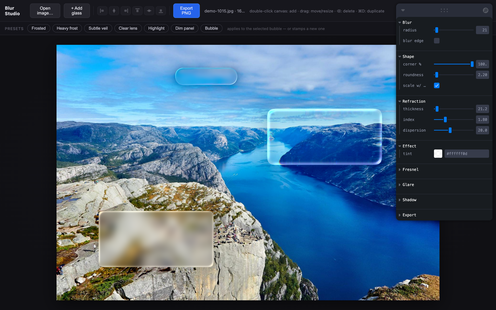
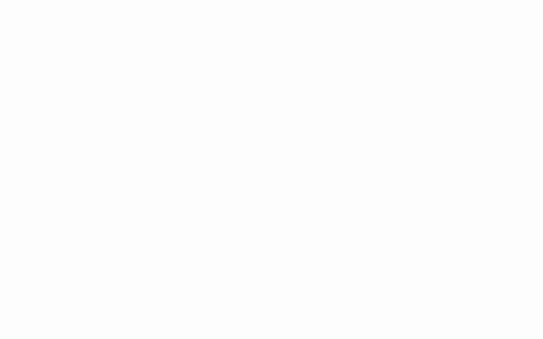
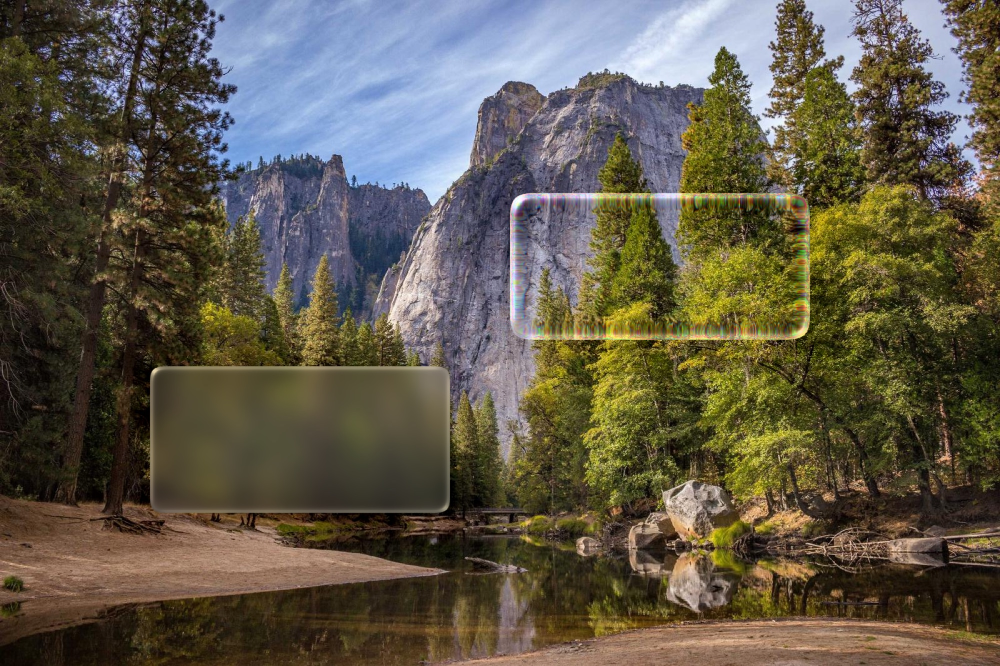

<div align="center">

# Blur Studio

### Apple-style liquid-glass blur & refraction panels for any photo — right in your browser.

[](./LICENSE)
[](https://rainn.works/blur-studio)
[](https://bun.sh)
[](#contributing)

<a href="https://rainn.works/blur-studio">
  
</a>

</div>

## Features

- ✨ **Real liquid glass** — physically-modelled refraction with chromatic dispersion, fresnel rim, glare and tint, running as WebGL2 shaders
- 🫧 **Multiple panels, each its own material** — stack as many as you like; glass over glass refracts correctly
- 🎚️ **Presets** — one-click frosted, heavy-frost, clear-lens and highlight looks, all computed from the panel's size
- 🖱️ **Direct manipulation** — drag, resize from 8 handles, nudge with arrows, align to edges/center, duplicate with ⌘D
- 🖼️ **Any photo** — drop, paste, or open; works from a thumbnail to a 40-megapixel original
- 📐 **Pixel-perfect export** — renders at the image's **original resolution**, so what you preview is exactly what you save
- ⚡ **Instant** — Bun + Vite dev loop, zero backend, everything runs on your GPU

## Quick start

```sh
bun install
bun run dev      # http://localhost:5173
```

```sh
bun run build    # static site in dist/
```

> Requires [Bun](https://bun.sh). Or just open the [live demo](https://rainn.works/blur-studio).

## Usage

<div align="center">
  
</div>

1. **Load a photo** — drop it on the window, paste from the clipboard, or hit *Open image…*
2. **Add glass** — *+ Add glass*, double-click the canvas, or pick a **preset** from the bar
3. **Shape it** — drag to move, pull the handles to resize, use the align buttons to snap to edges/center
4. **Tune it** — the right-hand panel edits the *selected* bubble: blur, refraction, fresnel, glare, tint, shadow
5. **Export** — renders at the photo's native size and downloads a PNG or JPEG

| Shortcut | Action |
| --- | --- |
| `double-click` | add a panel where you click |
| `drag` / handles | move / resize |
| `← ↑ → ↓` (`⇧` ×10) | nudge |
| `⌘D` / `Ctrl+D` | duplicate selected |
| `⌫` / `Delete` | remove selected |
| `Esc` | deselect |

<div align="center">
  
  <br />
  <sub>A full-resolution export — the same pipeline runs the on-screen preview and the saved file.</sub>
</div>

## How it works

Blur Studio is a small, layered WebGL2 compositor. Each panel is drawn in its own pass — **shadow → separable Gaussian blur → glass** — over the scene composited so far, so every bubble carries an independent material and stacked panels refract one another correctly. The glass itself is a signed-distance-field of a rounded superellipse, used to drive refraction offset, a thickness-based edge profile, an LCH-space glare highlight, and a fresnel rim.

Geometry and length-like settings are stored in **image pixels** and the renderer is resolution-independent (`u_dpr` = device pixels per image pixel, `1.0` at export) — which is why the live preview and the full-resolution export are the same picture. Gaussian weights are computed in-shader, and very large radii blur at a reduced resolution and upsample, keeping big kernels fast even on 20-megapixel-plus images.

## Contributing

Issues and PRs are welcome. To verify changes against a real browser:

```sh
bun run dev                  # in one terminal
bun scripts/smoke.mjs        # load → place panels → export, checks for errors
bun scripts/screenshots.mjs  # regenerate the README assets (needs ffmpeg)
```

## Credits

The glass shader model is adapted from [**liquid-glass-studio**](https://github.com/iyinchao/liquid-glass-studio) by Charles Yin (MIT), reworked into a layered, per-panel, resolution-independent compositor with size-aware presets and full-resolution export. Color-space conversions are from [GLSL-Color-Functions](https://github.com/Rachmanin0xFF/GLSL-Color-Functions) (MIT). Demo photos via [Lorem Picsum](https://picsum.photos).

## License

[MIT](./LICENSE) © RainnWorks
