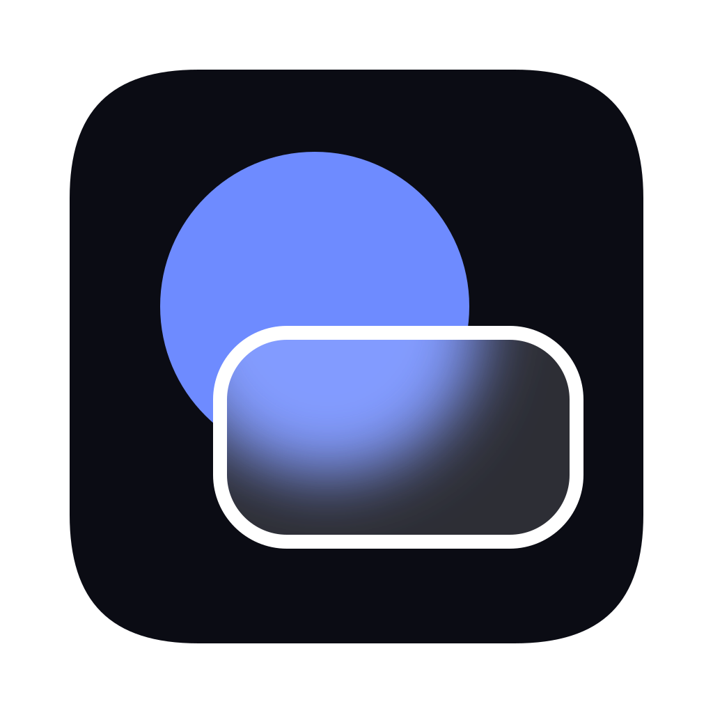
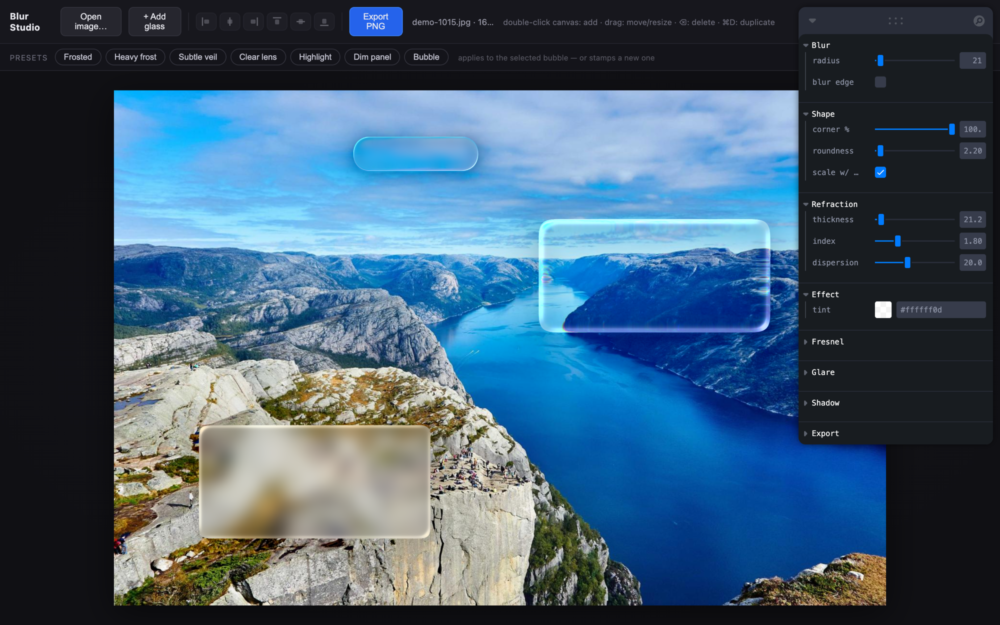
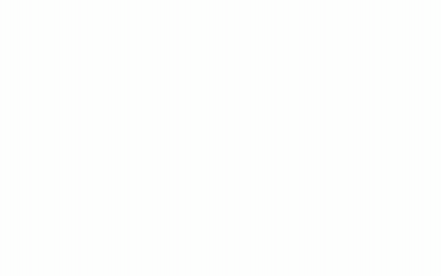
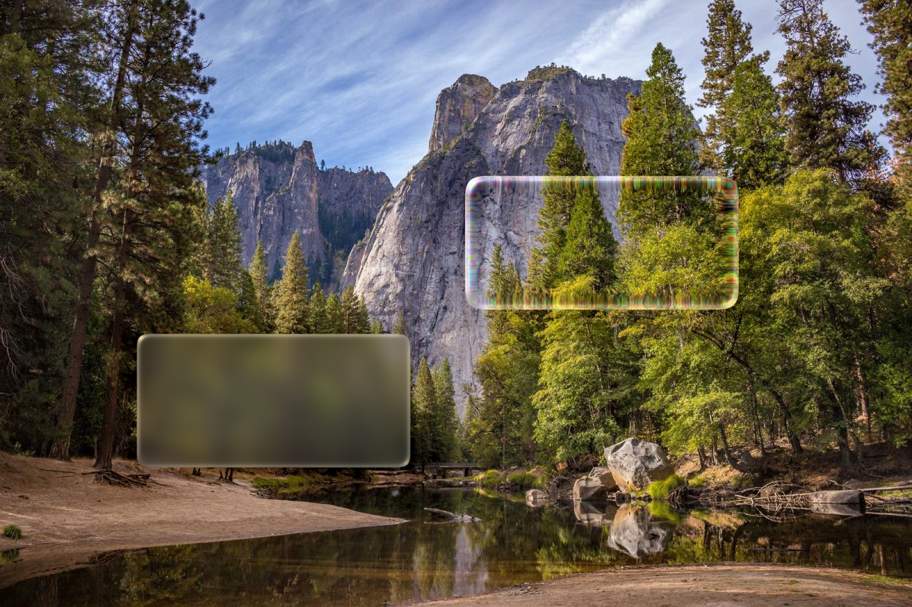
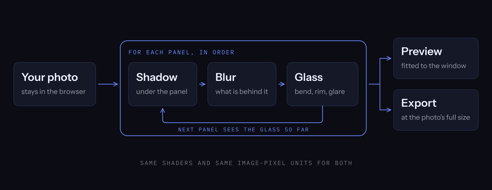

<p align="center">
  
</p>

<h1 align="center">Blur Studio</h1>

<p align="center">Apple-style liquid-glass blur and refraction panels for any photo, in the browser.</p>



## Getting started

1. **Open [rainn.works/blur-studio](https://rainn.works/blur-studio/)** in a browser with WebGL2.
2. **Load a photo.** Drop it in the middle of the page, paste it, or click **Open image…**. A glass panel appears in the middle of the photo.
3. **Pick a look.** Click a preset such as **Frosted** or **Clear lens**. Drag the panel where you want it, and pull its handles to resize it.
4. **Export.** Click **Export PNG**. Blur Studio saves the photo at its full size, as `<photo name>-glass.png`.

Your photo stays in your browser. Blur Studio has no server and uploads nothing.

To run your own copy, you need [Bun](https://bun.sh):

```sh
bun install
bun run dev      # http://localhost:5173
```

## Use



Add as many panels as you like. Each one has its own settings. Panels are drawn in
the order you add them, and the number on each shows that order. A later panel sits
on top, and it bends and blurs the panels under it.

| To | Do this |
|---|---|
| Add a panel | **+ Add glass**, or double-click the photo where you want it |
| Select a panel | Click it. Click the photo, or press Esc, to select none |
| Move | Drag it, or use the arrow keys: 1 photo pixel, or 10 with Shift |
| Resize | Drag one of its 8 handles |
| Line up | The six align buttons put it against an edge or the centre of the photo |
| Copy | ⌘D, or Ctrl+D |
| Delete | Backspace or Delete |

The presets set a panel's whole look. They work out their sizes from the panel and
the photo, so they suit a small chip and a full-width bar alike. With a panel
selected, a preset changes it. With none selected, a preset adds a new panel.

| Preset | Look |
|---|---|
| Frosted | Classic frosted glass |
| Heavy frost | A strong blur, for privacy |
| Subtle veil | A barely visible blur |
| Clear lens | No blur, just refraction |
| Highlight | Brightens and lifts an area |
| Dim panel | Darkens what is behind, for captions |
| Bubble | An orb with strong colour fringes |

The settings panel on the right edits the selected panel:

| Group | Settings |
|---|---|
| Blur | Radius, and whether the rim is blurred too |
| Shape | Corner size, corner roundness, and **scale w/ size** |
| Refraction | Thickness, index and dispersion |
| Effect | Tint colour and strength |
| Fresnel | The bright rim: range, hardness and strength |
| Glare | The highlight: range, hardness, strength, convergence, opposite side and angle |
| Shadow | Softness, strength and offset |
| Export | PNG or JPEG, and the JPEG quality (0.95 at first) |

With **scale w/ size** on, resizing a panel also scales its thickness, rim, glare and
shadow. The blur radius stays the same. With no panel selected, the settings you
change become the starting point for the next new panel.

Open a new photo and the panels stay, scaled to fit the new photo.



## How it works



Blur Studio draws on your GPU with WebGL2. It starts from the photo, then draws each
panel in three passes: its shadow, a Gaussian blur of what is behind it, and the
glass. The glass pass bends that background as a lens with rounded corners would,
splits the colours a little at the edges, and adds the rim, the glare and the tint.
Each panel draws over everything before it, which is why glass on glass looks right.

Every size, position and length is kept in photo pixels, not screen pixels. The
preview draws the photo at the size of the window. The export runs the same passes
again at the photo's own size, so the file matches what you saw. Blurs wider than
80 pixels, at the size being drawn, run at half size or smaller and are scaled
back up. This keeps a big blur fast on a large photo.

## Limits

- **It needs WebGL2.** Without it the page stays blank.
- **Nothing is saved.** Reload or close the tab and your panels are gone. There is no undo.
- **The export size has a ceiling.** It is the largest image your GPU can draw. A bigger photo is exported scaled down to fit.
- **The export has no transparency.** Transparent parts of a PNG come out opaque.
- **One photo at a time.** Dropping or pasting several files loads only the first.

## Build from source

You need [Bun](https://bun.sh).

```sh
bun install
bun run dev      # http://localhost:5173
bun run build    # dist/blur-studio/
```

The build expects to be served under `/blur-studio/`, so it lands in
`dist/blur-studio/`. To try it, serve `dist/` and open `/blur-studio/`:

```sh
python3 -m http.server -d dist 8080   # http://localhost:8080/blur-studio/
```

The tests drive the app in headless Chromium through Playwright. Start
`bun run dev`, then in a second terminal:

```sh
bunx playwright install chromium   # once
bun run smoke
```

`bun run smoke` loads a photo, adds panels with different settings, and checks that
the export downloads at the photo's full size with no page errors. How to rebuild
the images in this README is in [`assets/src/README.md`](assets/src/README.md).

## Credits

The glass shader is adapted from [liquid-glass-studio](https://github.com/iyinchao/liquid-glass-studio)
by Charles Yin (MIT). The colour-space conversions are from
[GLSL-Color-Functions](https://github.com/Rachmanin0xFF/GLSL-Color-Functions) (MIT).
The demo photos are from [Lorem Picsum](https://picsum.photos).

## License

[MIT](LICENSE). Copyright RainnWorks.
